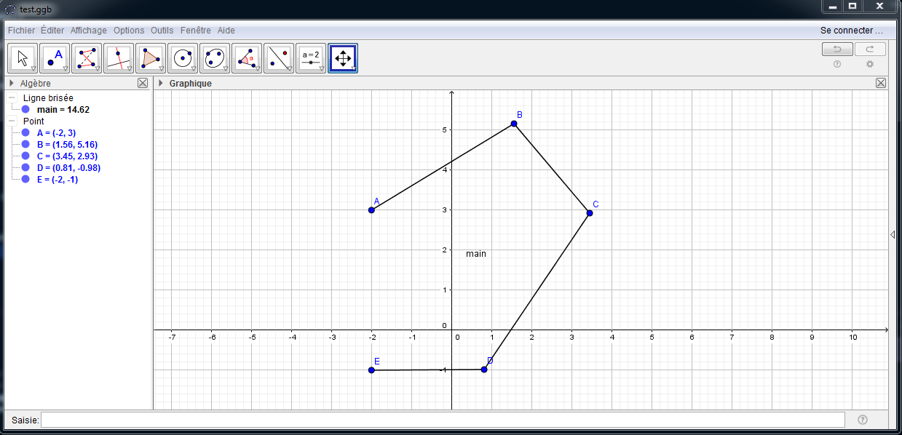

############
Outils
############

Cette rubrique regroupe tous les outils annexes qui peuvent avoir une utilisation dans l'élaboration d'une IA, ou d'automate.

.. Warning:: Documentation obsolète. 

***********
GeoGebra
***********

Preambule
--------------

La librairie GeoGebra permet de pouvoir extraire des points, angles, et lignes brisées. Cette librairie extrait les données des fichiers *.GGB qui ne sont que de simple fichiers XML compressés.
Voici un exemple de XML de Geogebra avec comme exemple un point appelé ``bornibus``.

.. code:: 

    <element type="point" label="bornibus">
    <show object="true" label="true"/>
    <objColor r="0" g="0" b="255" alpha="0.0"/>
    <layer val="0"/>
	<labelMode val="0"/>
	<animation step="1" speed="1" type="1" playing="false"/>
	<isShape val="false"/>
	<coords x="-0.72" y="4.14" z="1.0"/>
	<pointSize val="4"/>
	<pointStyle val="0"/>
 
Cette petite librairie utilise les librairies ``zipfile`` et ``xml.etree.ElementTree``.

API
-------------

.. function:: loadggb(filename)

    Converti le fichier .ggb en objet ELEMENT de la librairie ``xml.etree.ElementTree``.

    :param filename: Chemin et nom du fichier (absolu ou relatif).

.. function:: getpos(root, label)

    Retourne la position du point de nom label.

    :param Element root: Objet XML obtenu avec le loadggb.
    :param label: Nom du point à retourner.
    :return: Position sous forme de tuple.

.. function:: getangle(root, label)

    Retourne la valeur de l'angle avec le nom Label.

    :param Element root: Objet XML obtenu avec le loadggb.
    :param label: Nom de l'angle à retourner.
    :return: Valeur de l'angle.

.. function:: getpath(root,label)

    Retourne une liste des points de la ligne brisée se nommant label.

    :param Element root: Objet XML obtenu avec le loadggb.
    :param label: Nom de la ligne brisée.
    :return: Tuple des points composant la ligne brisée.

Utilisation
------------

La librairie étant très simple ce chapitre ce limitera à un exemple d'utilisation avec une ligne brisée généralement utilisée pour les paths.

Voici un exemple de Geogebra contenant une ligne brisée. Celle-ci prend le nom de ``main``.

Une fois le fichier sauvegardé (``example.ggb``), vous pouvez lancer votre python pour exploiter le fichier. Il faut d'abord ouvrir le fichier pour l'exploiter.

.. code:: 

    file = loadggb('example.ggb')

À partir d'ici il est très facile extraire les données comme ci-dessous : 

.. code::

    print(getpath(file,'main'))
    #[(-2.0, 3.0), (1.56, 5.161818181818181), (3.4509090909090903, 2.9254545454545458), (0.8145454545454542, -0.9836363636363615), (-2.0, -1.0)]

Il faut noter que pour les indices il faut écrire dans les méthodes comme cela : ``nom_{indice}``

***********************
RoadMap 
***********************

Cette librairie permet une utilisation simplifiée d'Igraph qui est une librairie de python permettant de créer des graphs. Grâce aux outils de cette librairie vous pourrez faire du path-finding dans un graph créer avec Geogebra.

Préambule
------------

Cette librairie utilise les méthodes de ``geogebra``, voir au dessus. Cette resource est composée d'une fonction d'intersection est  d'un objet roadmap.

API
------------------

.. function:: intersect(A, B)

    Cherche une intersection entre les deux segments donnés en argument.  

    :param tuple A: Coordonnées du premier segment avec la forme suivante : (xA1, yA1), (xA2, yA2).
    :param tuple B: Coordonnées du deuxième segment avec la forme suivante : (xB1, yB1), (xB2, yB2).
    :return boolean : Vrai si il y a intersection.

.. class:: RoadMap

    .. method:: __init__(vertices=list(), edges=set())

        Constructeur de l'objet RoadMap, elle a pour but de charger le graph.

        :param list vertices: Liste des sommets du graph.
        :param set edges: Set des segments du graph.

    .. method:: reset_edges()

        Calcule le poids des segments, c'est à dire leur longueur.

    .. method:: cut_edges(cutline)

        Retire les segments du graph qui coupent la cutline.

        :param cutline: Ligne permetant là découpe des segments du graph. Elle dois être de cette forme : ``(xCutLine, yCutLine), (xCutLine2, yCutLine2)``.

    .. method:: get_vertex_distance(vid, vertex)

        Calcule la distance entre deux sommets du graph.

        :param vid: Numéro du sommet , c'est à dire le rang de celle-ci dans la liste donnée au constructeur.
        :param vertex: Coordonnées du deuxième sommet. Dois être de cette forme ``x1, y1``
        :return: Distance entre les deux sommets.

    .. method:: get_closest_vertex(vertex)

        Trouve le sommet le plus près du point vertex.

        :param tuple vertex: Point de départ de la recherche.
        :return: Index du sommet du graph trouvé.

    .. method:: add_vertex(vertex)

        Ajoute un sommet au graph.

        :param vertex: Point à ajouter comme sommet au graph.
        :return: Index du sommet créé.

    .. method:: get_shortest_path(source, target)

        Réalise un path-finding à l'aide du graph.

        :param source: Point d'origine.
        :param target: Point d'arrivé.
        :return: Tableau avec chaque point du pathfinding.

    @staticmethod

    .. function:: load(geogebra, pattern='roadmap_{\s*\d+\s*,\s*\d+\s*}')

        Crée un objet Roadmap à partir d'un fichier Geogebra.

        :param geogebra: Nom du fichier ou objet GeoGebra.
        :param pattern: Structure du nom du graph sous GeoGebra.
        :return: Object Roadmap.

